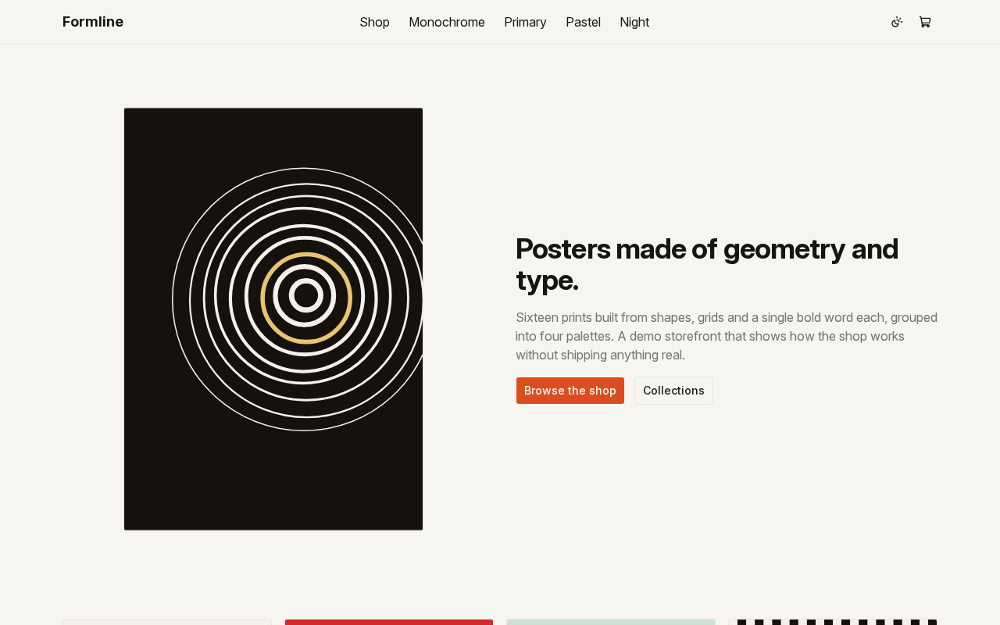
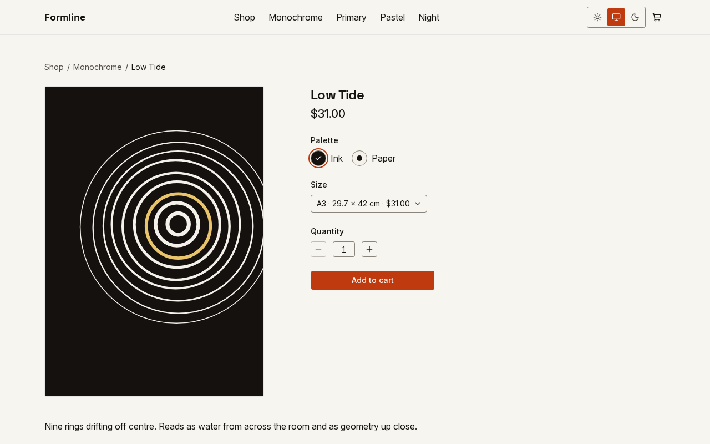
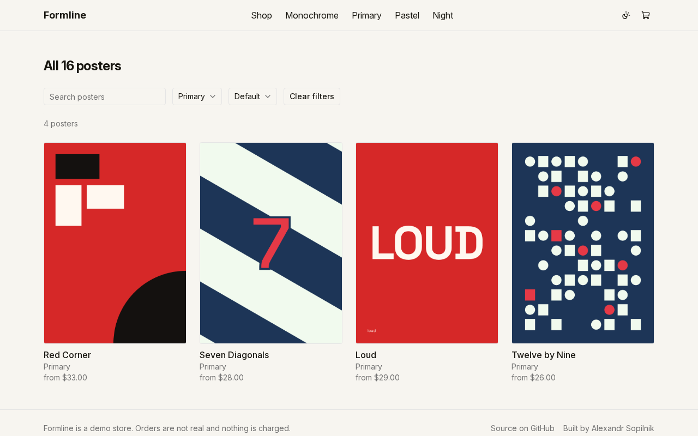

# Formline

A demo poster store built as a static Next.js export. Orders are not real and nothing is charged.





## What this is

A demo storefront and a work sample: sixteen posters, four palettes, a cart, and a checkout flow that
ends in a fake order. Nothing here ships a real product or takes a real payment.

## Stack

Next.js static export, TypeScript, React, Tailwind CSS 4 with CSS custom-property design tokens in
app/globals.css, Base UI primitives adapted with shadcn/ui conventions. Posters and OG images are
generated at build time from SVG templates and rendered to PNG with resvg. Vitest for unit tests,
Playwright for the end-to-end suite.

## Run it

### Development

```bash
pnpm install
pnpm dev
```

### Static build and preview

```bash
pnpm build && pnpm preview
```

Served on port 4321. `pnpm render` writes the posters into `public/posters` and `public/og`; they are
not in the tree.

## Tests

```bash
pnpm test
pnpm test:coverage
pnpm test:e2e
```

`pnpm test:e2e` builds the export first, so it always runs against the current code.

```bash
UPDATE_GOLDEN=1 pnpm test src/posters/rasterize.test.ts
```

Regenerates the golden poster PNG after an intended change to the rasteriser or a template.

Lighthouse, against `pnpm preview`:

```bash
npx lighthouse http://localhost:4321/ --preset=desktop --chrome-flags="--headless=new"
```

## How it is built

Poster templates are inline SVG, rendered to PNG at build time. The site is a fully static export — no
middleware, no server actions, no `useSearchParams`; shop filters live in the URL through the router
instead. The cart and a placed order are held in browser storage, read and written through small typed
helpers.

## Card payments

Checkout always offers a demo payment that takes no card details. When a checkout API is
configured through `NEXT_PUBLIC_CHECKOUT_API`, a second option opens a real Stripe Checkout
session in test mode, using Stripe's own test card. That function is not part of the static
export — it lives in `functions/checkout/`, with its own README covering how to run it locally
and what deploying it needs.

## Deployment

CI (`.github/workflows/ci.yml`) builds and tests on every push, then deploys the static export and the
checkout function as two separate jobs on `main`. Nothing here holds a value — only the names of the
repository variables and secrets that switch each job on and what each one controls.

Repository variables:

- `SITE_URL` — the canonical origin baked into the static export and passed to the checkout function;
  both deploy jobs run only when it is set.
- `AUTHOR_URL` — the footer author link baked into the static export.
- `NEXT_PUBLIC_CHECKOUT_API` — the checkout function's origin; unset, the storefront offers only the
  demo payment.
- `CHECKOUT_WORKER_NAME` — the stage switch for the checkout function: the deploy-function job runs
  only when this is set (together with `SITE_URL`), so the function stays undeployed while the store
  runs static-only.
- `BUNNY_STORAGE_ZONE`, `BUNNY_STORAGE_HOST`, `BUNNY_PULL_ZONE_ID` — the bunny.net storage zone and
  pull zone the static export is deployed and purged to.

Repository secrets (names only, never their values):

- `BUNNY_STORAGE_PASSWORD`, `BUNNY_API_KEY` — used by the static-site deploy job.
- `CLOUDFLARE_API_TOKEN`, `CLOUDFLARE_ACCOUNT_ID`, `STRIPE_SECRET_KEY`, `STRIPE_WEBHOOK_SECRET` — used
  by the deploy-function job, which checks all four are present and fails, naming the first one
  missing, before it deploys.

## Licence

MIT for the store's own code, see `LICENSE`. `src/components/ui/` is adapted from shadcn/ui (MIT).
Base UI (MIT). lucide-react (ISC). Inter and Space Grotesk are licensed under the SIL Open Font
License 1.1, with their licence files kept beside them at `src/fonts/LICENSE.txt` and
`src/fonts/SpaceGrotesk-OFL.txt`.
